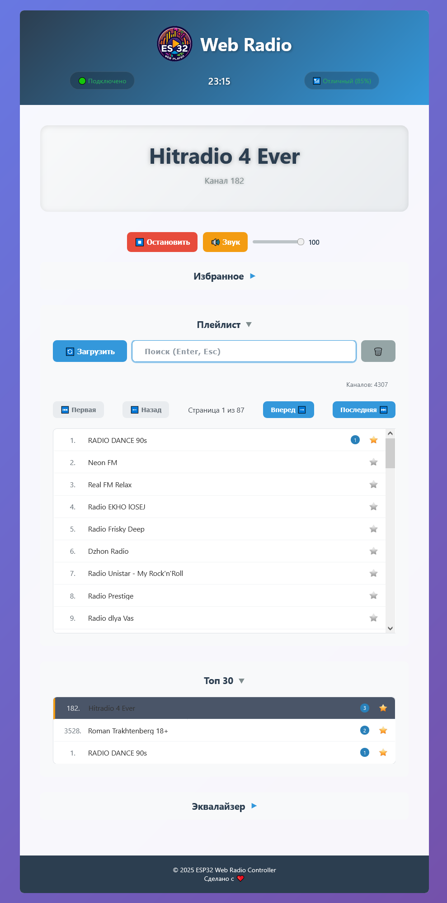

# ESP32_PCRadio

Hardware

- ESP32-S3 N16R8
- CJMCU-1334

Libraries

- ESP_IDF 5.4.2
- littlefs 1.20.1
- esp_audio_codec 2.3.0
- esp_audio_effects 1.1.0

Script `create_littlefs.cmd` for creating image and flashing data folder. (Uses mklittlefs.exe)

Config WiFi `./data/config.json`

```json
{
  "wifi": {
  "ssid": "SID",
  "password": "Pass"
  },
  "ntp":{
  "ntp_server": [
    "pool.ntp.org",
    "ntp.ix.ru",
    "ntp0.ntp-servers.net"
  ],
  "ntp_tz": "+0300"
  }
}
```

## Web interface



## API

### PLAYLIST update

```bash
curl -X POST http://<ip>/api/playlist -H "Content-Type: application/json" -d "update"
```

### Channel Num

```bash
curl -X POST http://<ip>/api/channel -H "Content-Type: application/json" -d "18"
```

### VOLUME 0-100

```bash
curl -X POST http://<ip>/api/volume -H "Content-Type: application/json" -d "90"
```

### MUTE 1 - mute, 0 - unpute

```bash
curl -X POST http://<ip>/api/mute -H "Content-Type: application/json" -d "1"
```

### SET EQ 0-9

```bash
curl -X POST http://<ip>/api/eq -H "Content-Type: application/json" -d "5"
```

### PLAYER STOP

```bash
curl -X POST http://<ip>/api/player -H "Content-Type: application/json" -d "stop"
```

## Build

Memory Type Usage Summary

| Memory Type/Section   | Used [bytes] | Used [%] | Remain [bytes] | Total [bytes] |
|-----------------------|-------------:|---------:|---------------:|--------------:|
| Flash Code            |       914990 |          |                |               |
|   .text               |       914990 |          |                |               |
| Flash Data            |       244872 |          |                |               |
|   .rodata             |       230676 |          |                |               |
|   .bss                |        13940 |          |                |               |
|   .appdesc            |          256 |          |                |               |
| DIRAM                 |       117571 |     34.4 |         224189 |        341760 |
|   .text               |        87299 |    25.54 |                |               |
|   .data               |        21792 |     6.38 |                |               |
|   .bss                |         8480 |     2.48 |                |               |
| IRAM                  |        16383 |    99.99 |              1 |         16384 |
|   .text               |        15356 |    93.73 |                |               |
|   .vectors            |         1027 |     6.27 |                |               |
| RTC FAST              |           52 |     0.63 |           8140 |          8192 |
|   .force_fast         |           28 |     0.34 |                |               |
|   .rtc_reserved       |           24 |     0.29 |                |               |

Total image size: 1271424 bytes (.bin may be padded larger)


<details><summary>Monitor log</summary>

```bash
ESP-ROM:esp32s3-20210327
Build:Mar 27 2021
rst:0x1 (POWERON),boot:0x28 (SPI_FAST_FLASH_BOOT)
SPIWP:0xee
mode:DIO, clock div:1
load:0x3fce2820,len:0x16d0
load:0x403c8700,len:0x4
load:0x403c8704,len:0xec8
load:0x403cb700,len:0x3160
entry 0x403c8950
I (27) boot: ESP-IDF v5.4.2 2nd stage bootloader
I (27) boot: compile time Jul  8 2025 22:04:51
I (27) boot: Multicore bootloader
I (27) boot: chip revision: v0.2
I (30) boot: efuse block revision: v1.3
I (34) qio_mode: Enabling default flash chip QIO
I (38) boot.esp32s3: Boot SPI Speed : 80MHz
I (42) boot.esp32s3: SPI Mode       : QIO
I (45) boot.esp32s3: SPI Flash Size : 16MB
I (49) boot: Enabling RNG early entropy source...
I (54) boot: Partition Table:
I (56) boot: ## Label            Usage          Type ST Offset   Length
I (63) boot:  0 nvs              WiFi data        01 02 00009000 00006000
I (69) boot:  1 phy_init         RF data          01 01 0000f000 00001000
I (76) boot:  2 ota_0            OTA app          00 10 00010000 00200000
I (82) boot:  3 ota_1            OTA app          00 11 00210000 00200000
I (89) boot:  4 storage          Unknown data     01 83 00410000 00200000
I (95) boot:  5 userdata         Unknown data     01 83 00610000 009f0000
I (102) boot: End of partition table
I (105) esp_image: segment 0: paddr=00010020 vaddr=3c0e0020 size=38614h (230932) map
I (147) esp_image: segment 1: paddr=0004863c vaddr=3fc9d600 size=05520h ( 21792) load
I (151) esp_image: segment 2: paddr=0004db64 vaddr=40374000 size=024b4h (  9396) load
I (153) esp_image: segment 3: paddr=00050020 vaddr=42000020 size=df630h (914992) map
I (294) esp_image: segment 4: paddr=0012f658 vaddr=403764b4 size=17050h ( 94288) load
I (312) esp_image: segment 5: paddr=001466b0 vaddr=600fe000 size=0001ch (    28) load
I (322) boot: Loaded app from partition at offset 0x10000
I (322) boot: Disabling RNG early entropy source...
I (332) octal_psram: ECC is enabled
I (333) octal_psram: vendor id    : 0x0d (AP)
I (333) octal_psram: dev id       : 0x02 (generation 3)
I (333) octal_psram: density      : 0x03 (64 Mbit)
I (338) octal_psram: good-die     : 0x01 (Pass)
I (342) octal_psram: Latency      : 0x01 (Fixed)
I (347) octal_psram: VCC          : 0x01 (3V)
I (351) octal_psram: SRF          : 0x01 (Fast Refresh)
I (356) octal_psram: BurstType    : 0x00 ( Wrap)
I (360) octal_psram: BurstLen     : 0x03 (1024 Byte)
I (365) octal_psram: Readlatency  : 0x02 (10 cycles@Fixed)
I (370) octal_psram: DriveStrength: 0x00 (1/1)
I (375) MSPI Timing: PSRAM timing tuning index: 10
I (378) esp_psram: Found 8MB PSRAM device
I (382) esp_psram: Speed: 80MHz
I (405) mmu_psram: Read only data copied and mapped to SPIRAM
I (478) mmu_psram: Instructions copied and mapped to SPIRAM
I (478) cpu_start: Multicore app
I (860) esp_psram: SPI SRAM memory test OK
I (868) cpu_start: Pro cpu start user code
I (869) cpu_start: cpu freq: 240000000 Hz
I (869) app_init: Application information:
I (869) app_init: Project name:     ESP32-PCRadio
I (873) app_init: App version:      6f48513
I (877) app_init: Compile time:     Jul  8 2025 22:03:57
I (882) app_init: ELF file SHA256:  1a803cc5c...
--- Warning: Checksum mismatch between flashed and built applications. Checksum of built application is 96f176cc814413a016119c754575a04781c7b5d1327b82e7056841d7786b04cf
I (886) app_init: ESP-IDF:          v5.4.2
I (890) efuse_init: Min chip rev:     v0.0
I (894) efuse_init: Max chip rev:     v0.99
I (898) efuse_init: Chip rev:         v0.2
I (902) heap_init: Initializing. RAM available for dynamic allocation:
I (908) heap_init: At 3FCA4C40 len 00044AD0 (274 KiB): RAM
I (913) heap_init: At 3FCE9710 len 00005724 (21 KiB): RAM
I (918) heap_init: At 3FCF0000 len 00008000 (32 KiB): DRAM
I (924) heap_init: At 600FE01C len 00001FCC (7 KiB): RTCRAM
I (929) esp_psram: Adding pool of 6514K of PSRAM memory to heap allocator
I (935) esp_psram: Adding pool of 30K of PSRAM memory gap generated due to end address alignment of drom to the heap allocator
I (947) spi_flash: detected chip: boya
I (950) spi_flash: flash io: qio
I (953) sleep_gpio: Configure to isolate all GPIO pins in sleep state
I (959) sleep_gpio: Enable automatic switching of GPIO sleep configuration
I (966) coexist: coex firmware version: 7b9a184
I (979) coexist: coexist rom version e7ae62f
I (979) main_task: Started on CPU0
I (989) main_task: Calling app_main()
This is esp32s3 chip with 2 CPU core(s), WiFi/BLE, silicon revision v0.2, PSRAM support not enabled in project configuration.
I (989) FLASH: JEDEC ID: 0x00684018
I (999) FLASH: Manufacturer ID: 0x68, Memory Type: 0x40, Capacity Code: 0x18
I (999) FLASH: Actual Flash Size (from JEDEC ID capacity_code 0x18): 16 MB
I (1009) FLASH: Configured Flash Size (reported by system/partition table): 16 MB
I (1019) MEMORY: Available heap memory:
I (1019) MEMORY:   Internal RAM (all): Free: 319924 bytes, Largest Free Block: 258048 bytes
I (1029) MEMORY:   Internal RAM (DMA capable): Free: 312164 bytes, Largest Free Block: 258048 bytes
I (1039) MEMORY:   Default (usually Internal): Free: 7018640 bytes, Largest Free Block: 6553600 bytes
I (1049) CONFIG: NVS initialized.
I (1049) CONFIG: Input config TZ: 'UTC', Formatted TZ for setenv: 'UTC'
I (1059) CONFIG: LittleFS partition 'storage' not found or not mounted. Initializing...
I (1059) CONFIG: Attempting to initialize LittleFS (Attempt 1/5)...
I (1069) CONFIG: LittleFS initialized and mounted successfully at /storage
I (1079) CONFIG: Input config TZ: '+0300', Formatted TZ for setenv: 'GMT-3'
I (1079) CONFIG: Configuration loaded successfully.
I (1089) CONFIG: WiFi SSID: FFE
I (1089) CONFIG: NTP Servers (3): pool.ntp.org
I (1089) CONFIG: NTP TZ Display: +0300, Formatted: GMT-3
I (1099) wifi_station: ESP_WIFI_MODE_STA
I (1099) pp: pp rom version: e7ae62f
I (1109) net80211: net80211 rom version: e7ae62f
I (1119) wifi:wifi driver task: 3fcb0038, prio:23, stack:6656, core=0
I (1119) wifi:wifi firmware version: bea31f3
I (1119) wifi:wifi certification version: v7.0
I (1129) wifi:config NVS flash: enabled
I (1129) wifi:config nano formatting: disabled
I (1129) wifi:Init data frame dynamic rx buffer num: 32
I (1139) wifi:Init static rx mgmt buffer num: 5
I (1139) wifi:Init management short buffer num: 32
I (1149) wifi:Init static tx buffer num: 16
I (1149) wifi:Init tx cache buffer num: 32
I (1149) wifi:Init static tx FG buffer num: 2
I (1159) wifi:Init static rx buffer size: 1600
I (1159) wifi:Init static rx buffer num: 10
I (1169) wifi:Init dynamic rx buffer num: 32
I (1169) wifi_init: rx ba win: 6
I (1169) wifi_init: accept mbox: 6
I (1179) wifi_init: tcpip mbox: 32
I (1179) wifi_init: udp mbox: 6
I (1179) wifi_init: tcp mbox: 6
I (1189) wifi_init: tcp tx win: 5760
I (1189) wifi_init: tcp rx win: 5760
I (1189) wifi_init: tcp mss: 1440
I (1199) wifi_init: WiFi/LWIP prefer SPIRAM
I (1199) wifi_init: WiFi IRAM OP enabled
I (1199) wifi_init: WiFi RX IRAM OP enabled
I (1209) phy_init: phy_version 701,f4f1da3a,Mar  3 2025,15:50:10
I (1239) wifi:mode : sta (30:ed:a0:12:8d:a0)
I (1239) wifi:enable tsf
I (1239) wifi_station: wifi_init_sta finished. Waiting for connection to SSID: SID...
I (1329) wifi:new:<13,0>, old:<1,0>, ap:<255,255>, sta:<13,0>, prof:1, snd_ch_cfg:0x0
I (1329) wifi:state: init -> auth (0xb0)
I (1329) wifi:state: auth -> assoc (0x0)
I (1339) wifi:state: assoc -> run (0x10)
I (1449) wifi:connected with SID, aid = 23, channel XX, BW20, bssid = yy:yy:yy:yy:yy:yy
I (1449) wifi:security: WPA2-PSK, phy: bgn, rssi: -52
I (1449) wifi:pm start, type: 1
...
I (12989) ntp_module: Current time (Local, TZ: +0300): 2025-07-08 23:27:09
```

</details>
